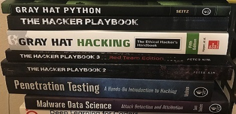

## About

### The Blog

A blog on ***Machine Learning and Python for Cybersecurity***, as the name signifies, primarily focusses on how machine learning and Python are applied in the Cybersecurity field. This means, while machine learning, Python, and cybersecurity would be discussed independently when essential, their intersections would be prioritized. 

The term machine learning, as used here, includes deep learning, and other corollary data science techniques. Cybersecurity entails all its sub-classes which includes, but not limited to, areas like software security, penetration testing, malware analysis, intrusion detection, vulnerability detection, and offensive security.

---

### Me
I am a third year Ph.D. candidate of Software Engineering (with minor in Cybersecurity) in [North Dakota State University's Department of Computer Science](https://www.ndsu.edu/cs/). My dissertation, under the supervision of [Dr. Simone Ludwig](http://www.cs.ndsu.nodak.edu/~siludwig/contact.html), is proposing an automated detection model for security vulnerabilities in program source code. 

This blog is my way of participating in infosec discussion and enriching my learning journey.

I had previously done a Ph.D.-awarding research in information visualization, at [Universiti Utara Malaysia](http://www.uum.edu.my/). This and other research can be found on my [Google Scholar page](https://scholar.google.com/citations?user=ROaTHt0AAAAJ&hl=en).

Thank you for reading!
