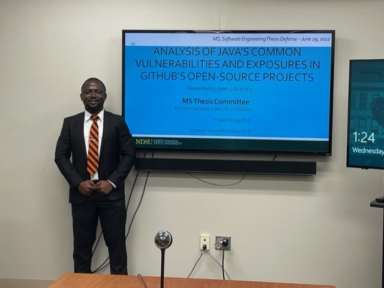
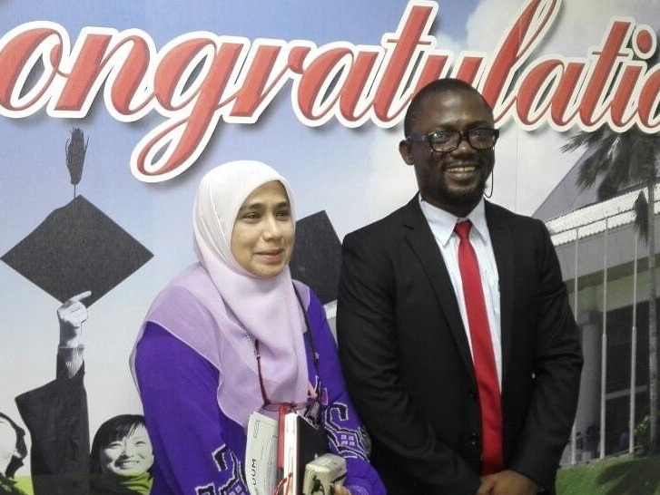

## About Me                                                                          

---
I currently work as a software engineer - machine learning and data engineering, with International Consulting Associates, Inc. 

My primary responsibilities are making quality data readily available for machine learning (ML) modeling, building and deploying data pipelines and ML models into production.

I am a fifth year Ph.D./MS candidate of Software Engineering (with minor in Cybersecurity) in [North Dakota State University's Department of Computer Science](https://www.ndsu.edu/cs/). 

My MS Thesis, under the supervision of [Dr. Malik Muhammad](http://cs.ndsu.nodak.edu/~mmalik/#), [analyzed the top 100 GitHub's Java projects to investigate the presence of vulnerabilities](https://github.com/Semiu/java-codesecurity). I defended this thesis on June 29, 2022.

My Ph.D. dissertation, under the supervision of [Dr. Simone Ludwig](http://www.cs.ndsu.nodak.edu/~siludwig/contact.html), is exploring machine and deep learning models for automated detection of security vulnerabilities in Java program source code. 

I had previously done a Ph.D.-awarding research in information visualization, graduated in 2016, from [Universiti Utara Malaysia](http://www.uum.edu.my/). 

My academic research publications can be found on my [Google Scholar page](https://scholar.google.com/citations?user=ROaTHt0AAAAJ&hl=en) and my resume [here](https://raw.githubusercontent.com/Semiu/Semiu.github.io/blob/master/assets/SemiuAkanmuResume.pdf).

This blog is my way of documenting my learnings and sharing them with you all.

Thank you for reading!
